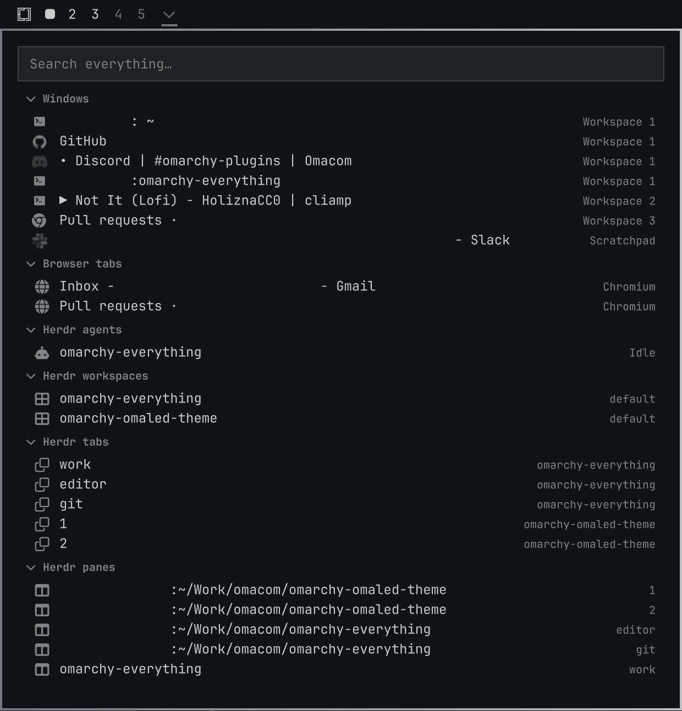
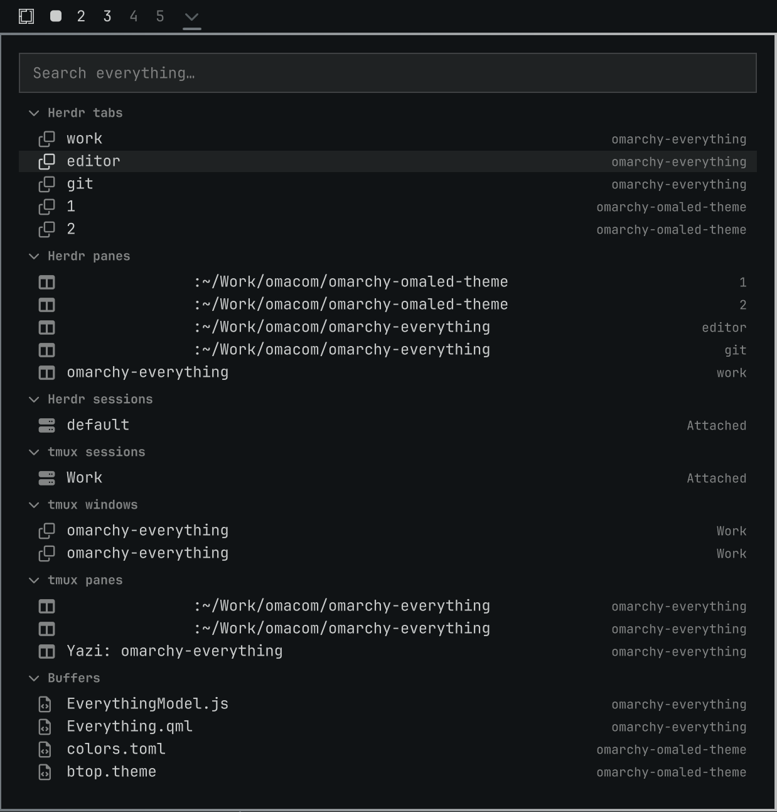
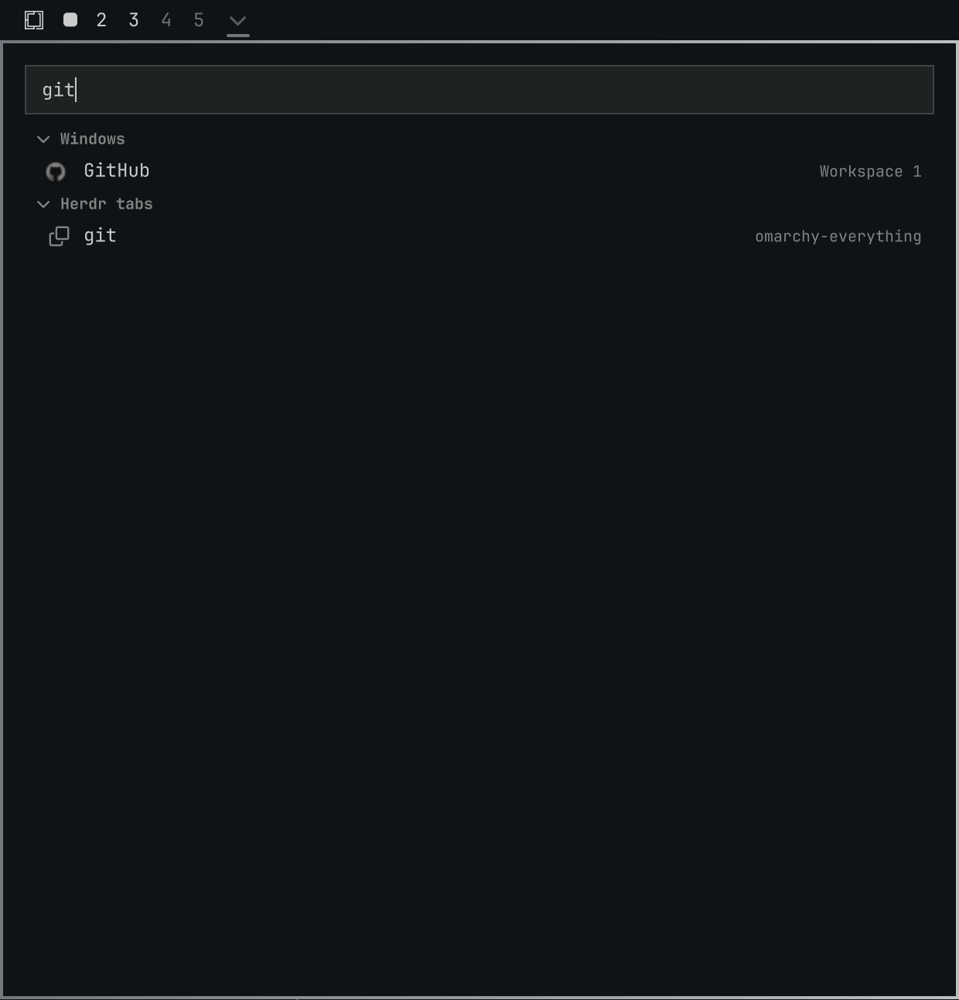

# Everything
List, search, and jump directly to every app, tab, buffer, agent... everything. An Omarchy plugin.





## Install

```bash
omarchy plugin add https://github.com/brianblakely/omarchy-everything.git --enable --yes
```

## Open

Click the arrow in the bar, or use a binding:

```lua
hl.unbind("SUPER + SLASH")
o.bind("SUPER + SLASH", "Everything", "omarchy-shell shell toggle b.everything")
```

# Configure

Right-click the bar icon to choose which groups appear in Everything.

## Update

```bash
omarchy plugin update b.everything
```

## Uninstall

```bash
omarchy plugin remove b.everything
```

## Keyboard Controls

| Focus | Keys | Action |
|---|---|---|
| Navigation | `K`, `Up` | Scroll up |
| Navigation | `J`, `Down` | Scroll down |
| Navigation | `H`, `Left` | Collapse the current group |
| Navigation | `L`, `Right` | Expand the current group |
| Navigation | `Home`, `End`, `g`, `G` | Scroll to top or bottom, respectively |
| Navigation | `Page Up`, `Page Down`, `Ctrl+U`, `Ctrl+D` | Move one page |
| Navigation | `Ctrl+P`, `Ctrl+N` | Move to the previous or next thing |
| Navigation | `Enter`, `Space` | Expand a collapsed group, or close Everything and activate the highlighted thing |
| Navigation | `/` | Focus the search field |
| Navigation | `X`, `Backspace`, `Delete` | Hide the highlighted thing from the list until restart |
| Navigation | `Tab`, `Shift+Tab` | Switch between search and the list |
| Search | `Down`, `Tab` | Switch to list |
| Settings panel | `Enter`, `Space` | Show or hide the selected group in results |
| Other | `Escape` | Clear a search / Close Everything |
